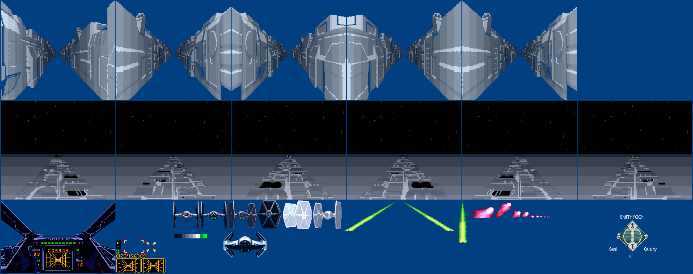
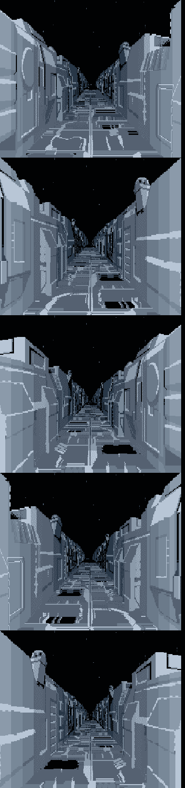
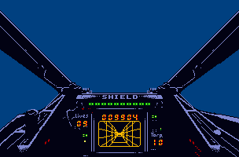

# Super Star Wars
Some of you may know Super Star Wars for the SNES. Unfortunately there were never ports for other systems (A Sega-Mega-Drive version was probably started). But at least for the Amiga there was nothing. Besides the jump&run part there are 3D sequences in between. All in all I find a porting appealing, but especially the Death Star trench approach I find exciting. On the SNES, a similar approach is taken to this as in Stardust in the intermediate levels. The background consists of single images (6 images in Stardust ), which always run through and thus create a tunnel effect.

It was relatively easy to find all the assets in SSW on the SNES:

It looks like on the SNES the images were dynamically assembled (floor independent of the walls). But on the Amiga it's better to assemble everything directly and not copy things dynamically. This way only the images have to rotate through and we have a tunnel effect without needing CPU or blitter resources for it. Fortunately, the SNES version is relatively color-barren (SNES can display up to 256 colors simultaneously), so we can get by with 8 colors (or 7 colors and a background color) for the trench. 

Similarly with the cockpit, we can get by with just a few colors: 

That is, we use dual playfield mode for the implementation. One playfield for the trench and one playfield for the cockpit. Laser shots and explosions can be realized with sprites. 

